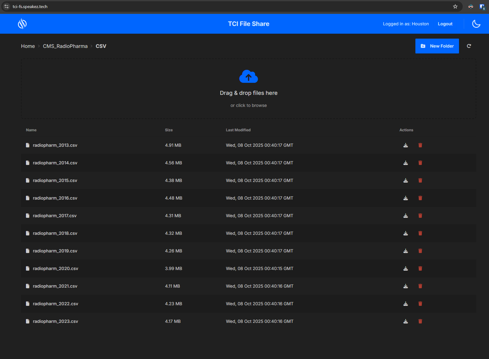

# FS Fileshare

[](https://www.cloudflare.com/)
[](https://workers.cloudflare.com/)
[](https://pages.cloudflare.com/)
[](https://www.cloudflare.com/products/r2/)

A modern file sharing applet built with F#, Fable, and CloudflareFS, featuring WebDAV support and a React-based web interface.



## NOTICE

A major current dependency on this is having the "CloudflareFS" repository built locally and mapping to those assemblies for building things like the CLI tool. Once those libraries a fully vetted and published this will become a simpler, standard 'nuget' operation to pull down the dependencies. If you're not in the mood to spelunk that deeply into local dependency building, this project is likely not for you. (yet)

## Architecture

This project consists of three main components:

### 1. Worker (Backend)
- **Technology**: F# compiled to JavaScript via Fable
- **Runtime**: Cloudflare Workers via CloudflareFS
- **Storage**: Cloudflare R2 (single shared bucket)
- **Features**:
  - Full WebDAV protocol support (PROPFIND, GET, PUT, DELETE, MKCOL, COPY, MOVE)
  - RESTful File API for web interface
  - Authentication using Cloudflare Secrets
  - CORS enabled for web access

### 2. Pages (Frontend)
- **Technology**: F# + Fable + React + Elmish
- **UI Framework**: DaisyUI (Tailwind CSS)
- **Features**:
  - Modern file manager interface
  - Drag-and-drop file upload
  - Directory navigation with breadcrumbs
  - File operations (upload, download, delete)
  - Folder creation
  - Responsive design

### 3. CLI (Deployment Tool)

- **Technology**: F# (.NET Tool)
- **Purpose**: Streamlined deployment and user management
- **Features**:
  - One-command deployment of Worker and Pages
  - User credential management via Cloudflare Secrets
  - Deployment status monitoring
  - Uses Cloudflare management APIs
  - Also wraps Fable and Wrangler for certain functions

> See [src/CLI/README.md](src/CLI/README.md) for installation, configuration, and usage details.

## Development

### Prerequisites
- .NET 8.0 SDK
- Node.js 20+
- Fable CLI

### Setup

1. Install dependencies:
```bash
npm install
dotnet tool restore
```

2. Start development server:
```bash
npm start
```

### Build

```bash
npm run build
```

## Authentication

Users are authenticated using Cloudflare Secrets with a shared R2 bucket for all users.

## License

MIT License - see [LICENSE](LICENSE) file for details.

Copyright © 2025 Rower Consulting
